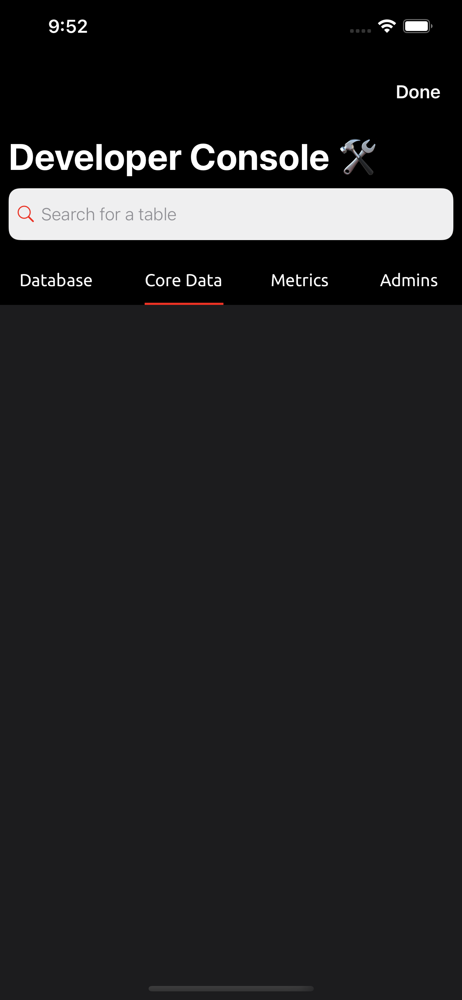
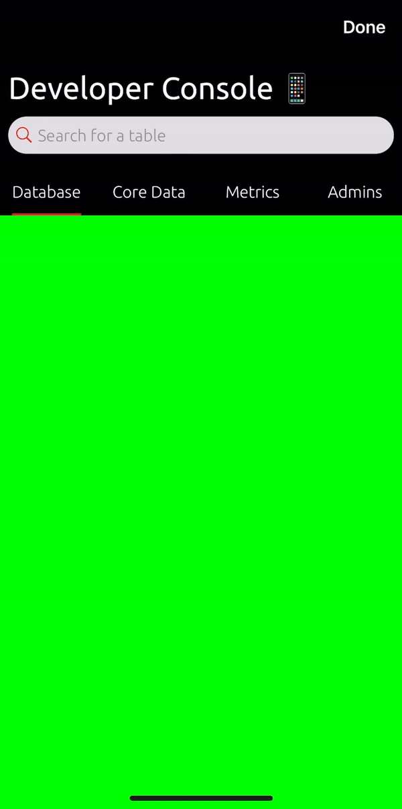
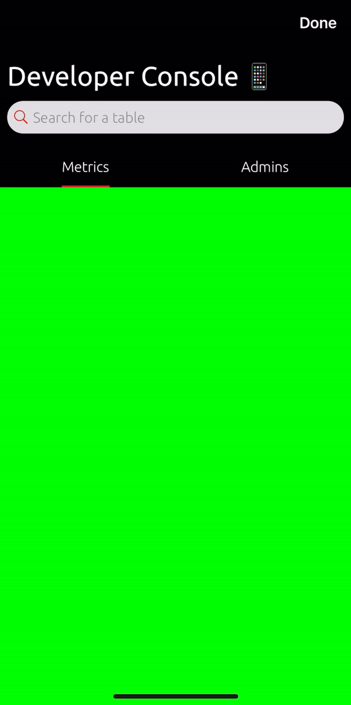

# Swift-Underlined-Button-Bar
Custom UIView class that hosts an array of UIbuttons that have an 'underline' UIView beneath them which moves from button to button when the user presses on them.

Quick Setup:

1.) Copy and paste or download the underlinedButtonBar.swift file into your project.

2.) Instantiate and then add the underlinedButtonBar to a view of your choice 

3.) Call the moveUnderLineTo method inside of your button action methods to move the line between the buttons specified.

4.) Enjoy!

